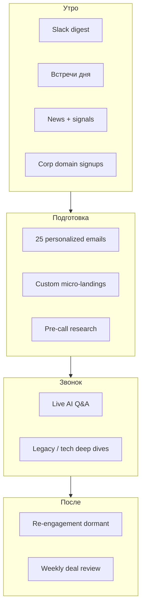

# LeadScaper × ChatGTM — анализ AI-GTM модели Cursor и применимость для РФ

> Референс: **ChatGTM** — внутренняя sales-AI платформа Cursor (~400 AE/SDR), описанная George Hou (Head of Corporate Sales).  
> Сравнение с [финансовой моделью LeadScaper](financial-model.html) · Архитектура: [index.html](index.html)  
> **Валюта прогноза:** ₽ · **Курс:** 78,27 ₽/USD (ЦБ РФ, 02.07.2026)

---

## 1. Что такое ChatGTM (референс Cursor)

ChatGTM — **не замена CRM**, а **оркестрационный слой** поверх GTM-стека: агенты + API + знания о продукте и процессе продаж.

| Компонент | Содержание |
|-----------|------------|
| **Знания** | Как Cursor продаёт, ICP, playbooks, objection handling |
| **Интеграции** | Salesforce, Gong, Slack, LinkedIn и др. — **все по API** |
| **Контекст сделок** | Статусы pipeline, изменения за ночь, новые сигналы |
| **Real-time** | Регистрации с corp-доменами, новости, social signals |
| **Создание** | 3 инженера построили v1; **500+ Skills** и **1000+ автоматизаций** добавили сами sales на natural language |

**Ключевой принцип:** augment humans, not replace CRM — «поверх», не «вместо».

---

## 2. Рабочий день SDR в модели ChatGTM



### 2.1. Утренний дайджест (Slack)

| Сигнал | Зачем | Риск без автоматизации |
|--------|-------|------------------------|
| Список встреч | Приоритизация дня | Опоздание с prep |
| Новости по ICP | Контекст для касания | Generic pitch |
| Intent signals | Тёплые лиды first | Пропуск «горячих» |
| **Corp domain signup** | Goldman / Perplexity в базе | **Потеря enterprise inbound** |

> Кейс из практики: в CRM «тихо» сидят регистрации с доменами tier-1 компаний — без скоринга их не видит ни один менеджер.

### 2.2. Outbound batch

- **25 персонализированных писем** / день / rep
- **Индивидуальные лендинги** под техстек и роль (micro-site / dynamic page)

### 2.3. Pre-call intelligence

Пример alert: *«CEO недавно писал в X, что ненавидит агressive sales»* → меняется tone of voice и opener.

### 2.4. In-call copilot

Real-time ответы на технические вопросы (миграция с legacy, архитектура) без эскалации на SE.

### 2.5. Post-sale motion

- Письма **спящим** (dormant) клиентам
- **Еженедельный AI-разбор сделок** для менеджера

---

## 3. ChatGTM → LeadScaper: mapping архитектуры

| ChatGTM capability | LeadScaper слой | Инструменты репозитория |
|--------------------|-----------------|-------------------------|
| ICP discovery, corp lists | **L1 Discovery** | [AI_Find_Customer](tools/ai-find-customer.html), [ICP Researcher](tools/icp-researcher.html), [TrendScan](tools/trendscan.html) |
| Enrich contacts, social footprint | **L2 Enrichment** | [ColdReach](tools/coldreach-scraper.html), [lead-generator](tools/lead-generator.html), [The 3rd Eye](tools/the-3rd-eye.html) |
| Pre-call research, pain points, PDF | **L3 Analysis** | [Company Research Agent](tools/company-research-agent-tavily.html), [Decision Maker Discovery](tools/automated-decision-making-discovery.html), [Business Researcher](tools/business-researcher.html) |
| Social signals, keyword monitoring | **L4 Engagement** | [Agent-X](tools/agent-x-tuitbot.html), [RedSignal](tools/redsignal.html), [Obsei](tools/obsei.html) |
| Orchestration, Slack alerts | **Orchestration** | [n8n workflow](tools/n8n-workflow.html), [awesome-n8n-templates](tools/awesome-n8n-templates.html) |
| CRM writeback | **Data layer** | PostgreSQL + amoCRM / Bitrix / Salesforce (см. [архитектуру](index.html#full-arch)) |

**Gap LeadScaper vs ChatGTM (v1):**

| ChatGTM feature | LeadScaper сегодня | Roadmap |
|-----------------|-------------------|---------|
| Gong call intelligence | ❌ нет native | Интеграция API (Mango/ZOOM transcript) |
| Dynamic micro-landings | ❌ | Layer 3 PDF + webhook to Webflow/Tilda |
| 500 sales-built Skills | ⚠️ 18 agents, не self-serve NL | n8n + skill builder |
| Corp signup scoring | ⚠️ через CRM webhook | L1 trigger agent |
| In-call copilot | ❌ | Real-time RAG на L3 reports |

---

## 4. Сравнение болей: ChatGTM-модель vs [FINANCIAL_MODEL §4](financial-model.html)

| Боль (ICP) | Решает ChatGTM | Решает LeadScaper (текущий) | Решает LeadScaper + RU stack |
|------------|----------------|----------------------------|------------------------------|
| Разрозненность tools | ✅ единый Slack/UI | ⚠️ dashboard + exports | ✅ amoCRM + orchestration |
| Медленный ресёрch | ✅ batch + pre-call | ✅ L1–L3 pipeline | ✅ + GigaChat/HH |
| Generic outreach | ✅ 25 personalized/day | ✅ L3 pain points | ✅ RU tone + TenChat context |
| Нет триггеров | ✅ real-time signals | ✅ L4 monitoring | ✅ TG/Habr вместо X |
| Потеря corp signups | ✅ **core feature** | ⚠️ нужен CRM agent | ✅ Bitrix/amo webhook |
| LinkedIn dependency | ✅ (US) | ⚠️ global tools | ✅ **HH/TenChat/VK** |
| In-call support | ✅ Gong+copilot | ❌ | 🔜 Phase 2 |
| Sales self-serve automation | ✅ 500 skills | ❌ | 🔜 n8n marketplace |
| Дорогой западный stack | N/A (internal) | ⚠️ API USD | ✅ локальные API ₽ |

**Вывод:** LeadScaper закрывает **60–75%** ChatGTM-паттерна out-of-the-box; оставшиеся 25–40% — CRM signup scoring, in-call copilot, sales-authored skills.

---

## 5. Конкурентный ландшафт (модель ChatGTM)

### 5.1. Global — «AI GTM orchestration»

| Продукт | Модель | Цена / seat | ChatGTM-like score | vs LeadScaper |
|---------|--------|-------------|-------------------|---------------|
| **Cursor ChatGTM** | Internal | — | ★★★★★ (ref) | Internal only |
| **Clay** | Enrichment + AI columns | $149–800/mo | ★★★★ | LeadScaper = deeper L3 reports + RU |
| **Apollo AI** | Sequences + enrich | $49–119/user | ★★★ | Weak РФ data |
| **Gong Engage** | Call AI + outreach | $100+/user | ★★★★ | No discovery layer |
| **Outreach Kaia** | Sales engagement AI | Enterprise | ★★★ | US-centric |
| **11x / Artisan** | AI SDR agents | $1–5K/mo | ★★★★ | Black-box, compliance risk |
| **Regie.ai** | Content + sequences | Enterprise | ★★★ | No OSINT L4 |
| **ZoomInfo Copilot** | Data + AI | $15K+/year | ★★★ | No РФ |

### 5.2. Россия — аналоги по функциям ChatGTM

| ChatGTM функция | Global tool | RU аналог | LeadScaper mapping |
|-----------------|-------------|-----------|------------------|
| CRM | Salesforce | **amoCRM**, **Битрикс24** | Data layer |
| Call recording AI | Gong | **Mango Office**, **RingCentral** (огран.), **Oktell** + Whisper | 🔜 integration |
| Slack digest | Slack | **Telegram** bot + **Пachca** / **Slack** (если есть) | [n8n](tools/n8n-workflow.html) |
| LinkedIn | LinkedIn Sales Nav | **TenChat**, **HH.ru**, **VK** | L2 RU adapters |
| Enrichment | Apollo | **Контур.Фокус**, **СПАРК**, **Seldon** | L2 |
| Social listening | X / Reddit | **Telegram**, **Habr**, **VC.ru** | L4 |
| Signup scoring | Salesforce rules | **amo webhook** + **Roistat** / custom | Agent L1 |
| Sequences | Outreach | **UniSender**, **SendPulse**, **Carrot quest** | L4 export |
| Weekly deal review | Gong Insights | **Google Sheets + AI** / **Bitrix BI** | L3 report agent |

### 5.3. Конкуренты РФ (категория «sales AI / GTM»)

| Конкурент | Что делает | Цена / мес | Боли закрывает | Не закрывает (vs ChatGTM) |
|-----------|------------|------------|----------------|---------------------------|
| **YouScan + CRM** | Social listening | 80–250K ₽ | L4 signals | Outbound gen, pre-call |
| **Seldon + менеджер** | База компаний | 40–150K ₽ | L1 lists | Personalization, L4 |
| **Carrot quest** | In-product chat | 15–80K ₽ | Inbound | Outbound research |
| **Roistat / сквозная** | Attribution | 20–60K ₽ | Marketing | SDR workflow |
| **ChatGPT + Excel** | DIY | ~2K ₽ | Ad-hoc | Real-time, CRM sync |
| **2–3 SDR в штате** | Human | 360–540K ₽ | Relationships | Scale, consistency |
| **LeadScaper (Config C–D)** | Full L1–L4 | 129–349K ₽ | **Discovery→Engagement** | In-call (Phase 2) |

**Win vs конкурентов РФ:** единственный open **multi-agent** стек с документированной архитектурой + ChatGTM-паттерн без LinkedIn lock-in.

---

## 6. Инструментарий: global stack vs LeadScaper vs RU replacement

### 6.1. Полная карта (как у Cursor, но через LeadScaper)

| # | Роль в ChatGTM | Global | LeadScaper agent | RU replacement |
|---|----------------|--------|------------------|----------------|
| 1 | Product / playbook knowledge | Internal wiki | Prompt + RAG on docs | GigaChat + корп. wiki |
| 2 | CRM | Salesforce | API connector | **amoCRM / Битrix24** |
| 3 | Call intelligence | Gong | — (roadmap) | **Mango** + transcript API |
| 4 | Team comms | Slack | n8n → Slack/TG | **Telegram** |
| 5 | Professional graph | LinkedIn | [linkedIn_scraper](tools/linkedin-scraper.html) | **HH + TenChat** |
| 6 | Email enrich | Apollo | [lead-generator](tools/lead-generator.html) | **Контур.Фокус** |
| 7 | Company discovery | ZoomInfo / Clay | [AI_Find_Customer](tools/ai-find-customer.html) | Yandex + **СПАРК** |
| 8 | Deep research | Manual + GPT | [Company Research Agent](tools/company-research-agent-tavily.html) | Tavily/GigaChat + СПАРК |
| 9 | Social OSINT | X monitoring | [Agent-X](tools/agent-x-tuitbot.html) | **TG channel monitor** |
| 10 | Warm forum leads | Reddit | [RedSignal](tools/redsignal.html) | **Habr / VC.ru** |
| 11 | Sentiment filter | Custom | [Obsei](tools/obsei.html) | Obsei + TG |
| 12 | Workflow automation | Internal | [n8n](tools/n8n-workflow.html) | n8n self-host Selectel |
| 13 | Corp signup alert | SF workflow | CRM webhook agent | amo **«крупный домен»** rule |
| 14 | Personalized email | ChatGTM gen | L3 + templates | RU templates |
| 15 | Micro-landing | Internal | — | Tilda API + L3 JSON |
| 16 | Dormant re-engagement | SF + AI | L4 + CRM segment | Bitrix segment |
| 17 | Weekly deal review | Gong + AI | L3 batch report | PDF → TG bot |
| 18 | Sales-built skills | NL → agent | n8n templates | [awesome-n8n-templates](tools/awesome-n8n-templates.html) |

### 6.2. Рекомендуемый RU ChatGTM-stack (Config D + CRM)

```
Утро:  amoCRM webhook → n8n → LeadScaper L1 score → Telegram digest
Prep:  L2 (HH/TenChat) → L3 report → 25 emails (UniSender)
Call:  L3 brief в Telegram + (Phase 2) transcript Q&A
Evening: L4 Habr/TG signals → amo tasks
```

Стоимость стека: см. [FINANCIAL_MODEL Config D RU](financial-model.html) — **~605K–805K ₽ OPEX** + CRM.

---

## 7. Портрет пользователя ChatGTM-style (РФ)

| Поле | Описание |
|------|----------|
| **Персона** | Head of Sales / RevOps в B2B SaaS или integrator, 10–50 sales FTE |
| **Боль #1** | «SDR тонут в ручном ресёрче, CRM не отражает реальность» |
| **Боль #2** | «Inbound с corp-доменами не скорится — теряем enterprise» |
| **Боль #3** | «Нет единого утреннего дайджеста — каждый сам копает Slack/TG» |
| **Боль #4** | «LinkedIn недоступен — не знаем, чем заменить Sales Nav» |
| **Боль #5** | «Gong/Outreach в USD и не для нашего рынка» |
| **Budget** | 150–500K ₽/мес (tools + 1 RevOps) |
| **Success metric** | Meetings booked ↑ 30%, corp signup response < 2h, COGS/lead ↓ |

---

## 8. Финансовый прогноз: категория «RU ChatGTM» (2026–2028)

> Продукт позиционируется как **LeadScaper GTM Suite** — ChatGTM-паттерн для РФ. Цифры согласованы с [FINANCIAL_MODEL §13](financial-model.html).

### 8.1. Допущения

| Параметр | 2026 | 2027 | 2028 |
|----------|------|------|------|
| Курс USD | 78,27 ₽ | 82 ₽ | 85 ₽ |
| Seats / клиент (avg) | 8 | 12 | 15 |
| ARPU / seat / мес | 12 000 ₽ | 14 000 ₽ | 16 000 ₽ |
| Clients (EOY) | 18 | 45 | 85 |
| Churn (annual) | 18% | 14% | 12% |
| COGS % revenue | 32% | 28% | 25% |

### 8.2. Выручка и EBITDA (прогноз)

| Год | Clients EOY | MRR (дек) | ARR (run-rate) | Revenue (факт год) | EBITDA margin |
|-----|-------------|-----------|----------------|-------------------|---------------|
| **2026** | 18 | 1,73 млн ₽ | 20,7 млн ₽ | **12,4 млн ₽** | −15 … −5% |
| **2027** | 45 | 7,56 млн ₽ | 90,7 млн ₽ | **58,0 млн ₽** | +8 … +15% |
| **2028** | 85 | 16,3 млн ₽ | 196 млн ₽ | **142 млн ₽** | +18 … +25% |

*MRR дек = clients × seats × ARPU; ramp внутри года учтён в Revenue (факт).*

### 8.3. Тарифная сетка «GTM Suite» (РФ)

| План | Seats | ChatGTM features | Цена / мес |
|------|-------|------------------|------------|
| **GTM Start** | 3 | Digest + L1–L2 + 50 comp | **59 900 ₽** |
| **GTM Pro** | 10 | + L3 reports + 25 emails/day automation | **179 000 ₽** |
| **GTM Team** | 25 | + L4 TG/Habr + CRM sync | **449 000 ₽** |
| **GTM Enterprise** | ∞ | + on-prem, custom skills, SLA | **от 990 000 ₽** |

### 8.4. Unit economics (GTM Pro, 10 seats)

| Метрика | Значение |
|---------|----------|
| ARPU account | 179 000 ₽/мес |
| COGS (API + infra) | ~52 000 ₽/мес |
| Gross margin | **71%** |
| CAC (RU outbound) | ~85 000 ₽ |
| Payback | **~4,5 мес** |
| LTV (24 мес, net) | ~2,55 млн ₽ |
| LTV/CAC | **~30×** |

### 8.5. Сравнение с [FINANCIAL_MODEL](financial-model.html) (Config C)

| | FIN_MODEL Config C | ChatGTM GTM Pro |
|--|-------------------|-----------------|
| Positioning | Research platform | **Sales daily workflow** |
| ARPU | 101–313K ₽ | 179–449K ₽ |
| Stickiness | Medium | **High** (daily digest habit) |
| Expansion | Layer upsell | Seats + skills |
| Y3 ARR potential | 103–160M ₽ (combined) | **+40–60M ₽** incremental |

---

## 9. Roadmap: LeadScaper → RU ChatGTM

```mermaid
gantt
    title LeadScaper GTM Suite Roadmap
    dateFormat YYYY-MM
    section Phase 1
    Corp signup agent + TG digest     :2026-07, 3M
    amoCRM/Bitrix bidirectional sync  :2026-08, 4M
    section Phase 2
    25-email batch workflow           :2026-11, 2M
    Pre-call brief automation         :2027-01, 2M
    section Phase 3
    Call transcript RAG (Mango)       :2027-04, 4M
    Sales NL skill builder            :2027-08, 6M
```

| Phase | Срок | Deliverable | ChatGTM parity |
|-------|------|-------------|----------------|
| **1** | Q3–Q4 2026 | TG digest, corp domain scoring, CRM sync | ~55% |
| **2** | Q1–Q2 2027 | Email batch, micro-PDF landing, dormant flows | ~75% |
| **3** | Q3 2027+ | In-call copilot, 100+ sales skills marketplace | ~90% |

---

## 10. Конфигурации LeadScaper под ChatGTM-сценарии

| ChatGTM use case | LeadScaper config | Ключевые tools |
|------------------|-------------------|----------------|
| Pilot (1 team, 5 SDR) | [RU-A / B](financial-model.html) | [AI_Find_Customer](tools/ai-find-customer.html), [ColdReach](tools/coldreach-scraper.html), n8n |
| Daily digest + outbound | [RU-C](financial-model.html) | L1–L3 + [n8n](tools/n8n-workflow.html) |
| Full GTM (signals + engage) | [Config D](financial-model.html) | + [RedSignal](tools/redsignal.html), [Agent-X pattern → TG](tools/agent-x-tuitbot.html) |
| Enterprise bank/telco | [Config E](financial-model.html) | On-prem + Контур + Bitrix |

---

## 11. Итоговое сравнение: три модели

| | Cursor ChatGTM | LeadScaper Global | **LeadScaper RU GTM Suite** |
|--|----------------|-------------------|----------------------------|
| Users | 400 internal AE | SaaS clients | 10–50 seats / client |
| CRM | Salesforce | HubSpot/SF | **amo / Bitrix** |
| Social | LinkedIn, X | X, Reddit | **TG, Habr, VK, TenChat** |
| Calls | Gong | — | Mango (Phase 3) |
| Comms | Slack | Slack | **Telegram** |
| Build team | 3 engineers | Product team | 2–3 eng + RevOps |
| Moat | Product knowledge | Multi-agent OSS stack | **RU data + ChatGTM UX** |

---

## 12. Disclaimer

- ChatGTM — описание публичного кейса Cursor (George Hou), не официальная документация Cursor Inc.
- Прогноз **симуляционный**, не investment advice.
- Замены LinkedIn/Gong/Slack для РФ — ориентиры; проверять compliance и ToS перед внедрением.
- Детальные OPEX/Config: [FINANCIAL_MODEL.md](FINANCIAL_MODEL.md).

---

*LeadScaper · ChatGTM Analysis v1.0 · июль 2026*
