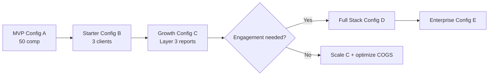
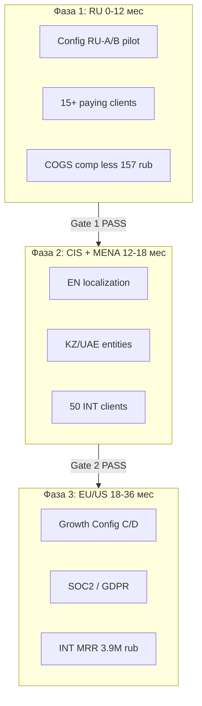

# LeadScaper — Финансовая модель и конфигурации системы

> Модель основана на архитектуре платформы: 4 слоя, 18 агентов, оркестрация CrewAI / LangGraph / n8n, стек FastAPI + PostgreSQL + Redis/Celery.
>
> **Валюта:** ₽ (рубли) · **Период:** месяц · **Дата модели:** июль 2026  
> **Курс пересчёта:** 1 USD = **78,27 ₽** (ЦБ РФ, 02.07.2026)  
> Зарубежные API оплачиваются в USD — в модели указана рублёвая стоимость с учётом курса; для stress-теста использовать **90 ₽/USD**.

---

## 1. Сводка

LeadScaper — многослойная AI-платформа B2B lead generation:

| Слой | Назначение | Ключевые инструменты |
|------|------------|----------------------|
| **1 · Discovery** | Поиск компаний | [AI_Find_Customer](tools/ai-find-customer.html), [GitHub Lead Signals](tools/github-lead-signals.html), [Clutch Scraper](tools/clutch-profile-scraper.html), [TrendScan](tools/trendscan.html), [ICP Researcher](tools/icp-researcher.html) |
| **2 · Enrichment** | Сбор контактов и соцсетей | [ColdReach-Scraper](tools/coldreach-scraper.html), [lead-generator](tools/lead-generator.html), [LinkedIn Scraper](tools/linkedin-scraper.html), [The 3rd Eye](tools/the-3rd-eye.html), [Business Researcher](tools/business-researcher.html) |
| **3 · Analysis** | Инсайты, ЛПР, отчёты | [Decision Maker Discovery](tools/automated-decision-making-discovery.html), [OWASP Social OSINT](tools/owasp-social-osint-agent.html), [Obsei](tools/obsei.html), [Company Research Agent (Tavily)](tools/company-research-agent-tavily.html) |
| **4 · Engagement** | Мониторинг и outreach | [Agent-X (TuitBot)](tools/agent-x-tuitbot.html), [RedSignal](tools/redsignal.html), [n8n workflow](tools/n8n-workflow.html), [Obsei](tools/obsei.html) |

> Полная архитектура: [index.html](index.html) · ICP и конкуренты: [§4](#4-icp-боли-клиента-и-конкуренты-по-конфигурациям) · **ChatGTM:** [chatgtm.html](chatgtm.html) · **РФ:** [§4.7](#47-источники-данных-рф-аналоги-linkedin-и-западных-платформ)

**Базовая единица расчёта:** обработка **1 компании** от discovery до CRM (или до выбранного слоя).

---

## 2. Допущения модели

### 2.1. Объёмы (референсные сценарии)

| Параметр | MVP | Starter | Growth | Scale | Enterprise |
|----------|-----|---------|--------|-------|------------|
| Компаний / мес | 50 | 200 | 1 000 | 5 000 | 20 000 |
| ЛПР на компанию | 3 | 5 | 5 | 8 | 10 |
| Отчётов (Layer 3) | 20% | 50% | 80% | 90% | 100% |
| Мониторинг (Layer 4) | выкл | 100 ключ. | 500 ключ. | 2 000 ключ. | 10 000 ключ. |
| Активных клиентов SaaS | 1 (internal) | 3 | 15 | 40 | 8 (крупные) |

### 2.2. Тарифы внешних сервисов (unit cost, ₽)

| Компонент | Единица | Эконом | Стандарт | Премиум |
|-----------|---------|--------|----------|---------|
| LLM (Groq Llama 3.3 70B) | 1M tokens in/out | 4 / 6 ₽ | — | — |
| LLM (GPT-4.1 mini) | 1M tokens | 31 / 125 ₽ | — | — |
| LLM (GPT-4.1 / Claude Sonnet) | 1M tokens | — | 157 / 626 ₽ | — |
| LLM (reasoning: o3 / DeepSeek-R1) | 1M tokens | — | — | 783 / 3 131 ₽ |
| Tavily Search | 1 запрос | 0,6 ₽ | 0,5 ₽ | 0,3 ₽ |
| Google Custom Search | 1 запрос | 0,4 ₽ | 0,4 ₽ | 0,4 ₽ |
| Exa.ai | 1 запрос | 0,8 ₽ | 0,5 ₽ | 0,4 ₽ |
| Apify (GitHub Lead Signals) | 1 компания | 1,6 ₽ | 1,2 ₽ | 0,8 ₽ |
| Jina Reader | 1 URL | 0 ₽ | 0,02 ₽ | 0,01 ₽ |
| Apollo.io (email enrich) | 1 контакт | — | 4 ₽ | 2 ₽ |
| Langfuse (observability) | 1M events | 0 ₽ | 0 ₽ | включено в Team |

> **RU-локальный стек** (GigaChat, YandexGPT, Контур.Фокус, HH.ru): на Layer 1–2 стоимость ниже на **40–60%** — см. [§4.7](#47-источники-данных-рф-аналоги-linkedin-и-западных-платформ) и [§13](#13-российский-рынок--локализация-и-экономика).

### 2.3. Потребление ресурсов на 1 компанию (полный пайплайн, ₽)

| Слой | LLM tokens | Search API | Прочее | COGS / компания |
|------|------------|------------|--------|-----------------|
| Layer 1 | 80K | 5 запросов | Apify 0.3× | **12 – 35 ₽** |
| Layer 2 | 120K | 3 запроса | scrape CPU | **16 – 47 ₽** |
| Layer 3 | 400K | 8 Tavily | PDF gen | **63 – 274 ₽** |
| Layer 4 (passive) | 50K/мес на ключ. | stream | — | **1,6 ₽/ключ./мес** |
| Оркестрация + CRM write | 20K | — | queue | **4 – 12 ₽** |
| **Итого (Layers 1–3)** | ~620K | ~16 | — | **94 – 368 ₽** |
| **Итого (Full stack + 50 ключ.)** | + | + | — | **+ 78 ₽/мес** |

> При Groq + Tavily Basic — нижняя граница. GPT-4.1 + reasoning на Layer 3 — верхняя.  
> **RU локальный стек (L1–3):** **44 – 139 ₽** / компания.

---

## 3. Конфигурации системы

### Каталог инструментов по слоям

| Слой | ID | Инструмент | Документация |
|------|----|------------|--------------|
| L1 | 1.1 | AI_Find_Customer | [tools/ai-find-customer.html](tools/ai-find-customer.html) |
| L1 | 1.2 | GitHub Lead Signals | [tools/github-lead-signals.html](tools/github-lead-signals.html) |
| L1 | 1.3 | Clutch Profile Scraper | [tools/clutch-profile-scraper.html](tools/clutch-profile-scraper.html) |
| L1 | 1.4 | TrendScan | [tools/trendscan.html](tools/trendscan.html) |
| L1 | 1.5 | ICP Researcher | [tools/icp-researcher.html](tools/icp-researcher.html) |
| L2 | 2.1 | ColdReach-Scraper | [tools/coldreach-scraper.html](tools/coldreach-scraper.html) |
| L2 | 2.2 | lead-generator | [tools/lead-generator.html](tools/lead-generator.html) |
| L2 | 2.3 | linkedIn_scraper | [tools/linkedin-scraper.html](tools/linkedin-scraper.html) |
| L2 | 2.4 | The 3rd Eye | [tools/the-3rd-eye.html](tools/the-3rd-eye.html) |
| L2 | 2.5 | Business Researcher | [tools/business-researcher.html](tools/business-researcher.html) |
| L3 | 3.1 | Automated-Decision-Making-Discovery | [tools/automated-decision-making-discovery.html](tools/automated-decision-making-discovery.html) |
| L3 | 3.2 | OWASP SocialOSINTAgent | [tools/owasp-social-osint-agent.html](tools/owasp-social-osint-agent.html) |
| L3 | 3.3 | Obsei (analysis) | [tools/obsei.html](tools/obsei.html) |
| L3 | 3.4 | Company Research Agent (Tavily) | [tools/company-research-agent-tavily.html](tools/company-research-agent-tavily.html) |
| L4 | 4.1 | Agent-X (TuitBot) | [tools/agent-x-tuitbot.html](tools/agent-x-tuitbot.html) |
| L4 | 4.2 | RedSignal | [tools/redsignal.html](tools/redsignal.html) |
| L4 | 4.3 | n8n workflow | [tools/n8n-workflow.html](tools/n8n-workflow.html) |
| L4 | 4.4 | Obsei (engagement) | [tools/obsei.html](tools/obsei.html) |
| L4 | — | awesome-n8n-templates | [tools/awesome-n8n-templates.html](tools/awesome-n8n-templates.html) |

---

### Конфигурация A — **MVP / Internal Lab**

**Цель:** проверить гипотезу ICP, ≤50 компаний/мес, один оператор.

```
┌─────────────────────────────────────────┐
│  Streamlit / локальный UI               │
├─────────────────────────────────────────┤
│  Layer 1: AI_Find_Customer              │
│  Layer 2: ColdReach + lead-generator    │
├─────────────────────────────────────────┤
│  SQLite · без CRM · ручной экспорт CSV  │
└─────────────────────────────────────────┘
```

| Параметр | Значение |
|----------|----------|
| Слои | 1 + 2 (частично) |
| Агенты | 3 из 18 |
| LLM | Groq Llama 3.3 / GigaChat |
| Search | Google CSE free tier (100/день) |
| Infra | Laptop / VPS ~390 ₽ |
| Оркестрация | скрипты, без n8n |
| Layer 4 | ❌ |
| CRM | CSV / Google Sheets |

**Инструменты (3 из 18)**

| Слой | Инструмент | Ссылка |
|------|------------|--------|
| L1 | AI_Find_Customer | [ai-find-customer.html](tools/ai-find-customer.html) |
| L2 | ColdReach-Scraper | [coldreach-scraper.html](tools/coldreach-scraper.html) |
| L2 | lead-generator | [lead-generator.html](tools/lead-generator.html) |

**Фиксированные расходы / мес**

| Статья | ₽ / мес |
|--------|---------|
| VPS (опционально) | 390 – 1 565 |
| Домен + мониторинг | 390 |
| LLM + API (50 комп.) | 4 700 – 11 740 |
| **Итого OPEX** | **5 480 – 13 700** |

**Unit economics:** 110 – 274 ₽ / компания  
**Break-even (если продавать лиды):** ~25–40 квалиф. лидов × 390–550 ₽/лид

---

### Конфигурация B — **Starter SaaS**

**Цель:** 3–5 малых клиентов, автоматизация Layer 1–2, базовый дашборд.

```
┌─────────────────────────────────────────┐
│  Next.js Dashboard + API (FastAPI)      │
├─────────────────────────────────────────┤
│  LangGraph orchestrator                 │
│  L1: AI_Find_Customer, ICP Researcher   │
│  L2: ColdReach, lead-generator, 3rd Eye │
├─────────────────────────────────────────┤
│  PostgreSQL · Redis · Celery (1 worker) │
│  amoCRM / HubSpot Free                  │
└─────────────────────────────────────────┘
```

| Параметр | Значение |
|----------|----------|
| Слои | 1 + 2 |
| Агенты | 7 |
| LLM | Groq + GPT-4.1 mini |
| Infra | VPS 4 vCPU / 8 GB ~3 130 ₽ |
| Объём | 200 комп./мес × 3 клиента |

**Инструменты (7 из 18)**

| Слой | Инструмент | Ссылка |
|------|------------|--------|
| L1 | AI_Find_Customer | [ai-find-customer.html](tools/ai-find-customer.html) |
| L1 | ICP Researcher | [icp-researcher.html](tools/icp-researcher.html) |
| L1 | GitHub Lead Signals *(опц.)* | [github-lead-signals.html](tools/github-lead-signals.html) |
| L2 | ColdReach-Scraper | [coldreach-scraper.html](tools/coldreach-scraper.html) |
| L2 | lead-generator | [lead-generator.html](tools/lead-generator.html) |
| L2 | The 3rd Eye | [the-3rd-eye.html](tools/the-3rd-eye.html) |
| L2 | linkedIn_scraper *(опц.)* | [linkedin-scraper.html](tools/linkedin-scraper.html) |

**Фиксированные расходы / мес**

| Статья | ₽ / мес |
|--------|---------|
| Compute (API + worker + DB) | 6 260 – 11 740 |
| Langfuse / логи | 0 – 3 910 |
| CRM seats | 0 – 7 040 |
| Support (0.2 FTE) | 31 300 |
| **Fixed OPEX** | **37 560 – 53 990** |

**Variable (600 comp.)**

| Статья | ₽ / мес |
|--------|---------|
| COGS API | 56 350 – 140 900 |
| **Variable** | **56 350 – 140 900** |

**Total OPEX:** **93 910 – 194 890 ₽ / мес**  
**COGS / компания:** **157 – 325 ₽**

**Рекомендуемый тариф клиента:** **23 400 ₽/мес** (до 200 comp, Layer 1–2)  
**Валовая маржа:** 45–65% при 3 клиентах (MRR **70 200 ₽**)

---

### Конфигурация C — **Growth (Layers 1–3)**

**Цель:** mid-market outbound, PDF-отчёты, ЛПР, sentiment — основной продукт.

| Параметр | Значение |
|----------|----------|
| Слои | 1 + 2 + 3 |
| Агенты | 14 |
| LLM mix | Groq/GigaChat (bulk) + Claude/GPT-4.1 (reports) |
| Search | Tavily Pro + Google CSE |
| Объём | 1 000 comp./мес, 15 клиентов |

**Инструменты (14 из 18 — слои 1–3)**

| Слой | Инструмент | Ссылка |
|------|------------|--------|
| L1 | AI_Find_Customer | [ai-find-customer.html](tools/ai-find-customer.html) |
| L1 | GitHub Lead Signals | [github-lead-signals.html](tools/github-lead-signals.html) |
| L1 | Clutch Profile Scraper | [clutch-profile-scraper.html](tools/clutch-profile-scraper.html) |
| L1 | TrendScan | [trendscan.html](tools/trendscan.html) |
| L1 | ICP Researcher | [icp-researcher.html](tools/icp-researcher.html) |
| L2 | ColdReach-Scraper | [coldreach-scraper.html](tools/coldreach-scraper.html) |
| L2 | lead-generator | [lead-generator.html](tools/lead-generator.html) |
| L2 | linkedIn_scraper | [linkedin-scraper.html](tools/linkedin-scraper.html) |
| L2 | The 3rd Eye | [the-3rd-eye.html](tools/the-3rd-eye.html) |
| L2 | Business Researcher | [business-researcher.html](tools/business-researcher.html) |
| L3 | Automated-Decision-Making-Discovery | [automated-decision-making-discovery.html](tools/automated-decision-making-discovery.html) |
| L3 | OWASP SocialOSINTAgent | [owasp-social-osint-agent.html](tools/owasp-social-osint-agent.html) |
| L3 | Obsei | [obsei.html](tools/obsei.html) |
| L3 | Company Research Agent (Tavily) | [company-research-agent-tavily.html](tools/company-research-agent-tavily.html) |

**Фиксированные расходы / мес**

| Статья | ₽ / мес |
|--------|---------|
| Compute (k8s / 2× app + 3 workers) | 27 400 – 47 000 |
| PostgreSQL managed | 6 260 – 11 740 |
| Observability (Langfuse, Sentry) | 7 830 |
| CRM + integrations | 23 500 |
| DevOps (0.3 FTE) | 117 400 |
| **Fixed OPEX** | **182 390 – 207 470** |

**Variable (1 000 comp.)**

| Статья | ₽ / мес |
|--------|---------|
| COGS Layers 1–3 | 93 900 – 367 900 |
| Email enrich (Apollo, 5K contacts) | 11 740 – 19 570 |
| **Variable** | **105 640 – 387 470** |

**Total OPEX:** **288 030 – 594 940 ₽ / мес**

**Тарифная сетка**

| План | Comp/мес | Layers | Цена / мес | COGS | Gross margin |
|------|----------|--------|------------|------|--------------|
| Pro | 100 | 1–2 | **39 100 ₽** | ~19 570 ₽ | 50% |
| Business | 300 | 1–3 | **101 700 ₽** | ~70 400 ₽ | 31% |
| Team | 1 000 | 1–3 + 5 seats | **313 000 ₽** | ~234 800 ₽ | 25% |

**MRR при 15 клиентах (mix):** ~**1,41 – 1,96 млн ₽**  
**Net margin (после fixed):** 15–35%

---

### Конфигурация D — **Full Stack (+ Layer 4 Engagement)**

**Цель:** social listening, warm leads, semi-auto outreach с human-in-the-loop.

| Параметр | Значение |
|----------|----------|
| Слои | 1 + 2 + 3 + 4 |
| Агенты | 18 |
| Мониторинг | 2 000 trigger keywords |
| n8n | Cloud Pro или self-host |
| Объём | 5 000 comp./мес, 40 клиентов |

**Инструменты (18 из 18 — полный стек)**

| Слой | Инструмент | Ссылка |
|------|------------|--------|
| L1–L3 | Все инструменты Config C | см. [Config C](#конфигурация-c--growth-layers-13) |
| L4 | Agent-X (TuitBot) | [agent-x-tuitbot.html](tools/agent-x-tuitbot.html) |
| L4 | RedSignal | [redsignal.html](tools/redsignal.html) |
| L4 | n8n workflow | [n8n-workflow.html](tools/n8n-workflow.html) |
| L4 | Obsei (engagement filter) | [obsei.html](tools/obsei.html) |
| L4 | awesome-n8n-templates | [awesome-n8n-templates.html](tools/awesome-n8n-templates.html) |

> Оркестрация L4: [Agent-X](tools/agent-x-tuitbot.html) + [RedSignal](tools/redsignal.html) + [n8n](tools/n8n-workflow.html) → AI Filter ([Obsei](tools/obsei.html) + [OWASP OSINT](tools/owasp-social-osint-agent.html)) — см. [архитектуру Layer 4](index.html#layer-4)

**Фиксированные расходы / мес**

| Статья | ₽ / мес |
|--------|---------|
| Compute + queue | 62 600 – 93 900 |
| n8n Cloud Pro | 3 910 – 15 650 |
| Data storage (reports, OSINT) | 7 830 – 23 500 |
| Compliance / legal review | 39 100 |
| Team (2 eng + 1 CS) | 939 000 |
| **Fixed OPEX** | **1,05 – 1,11 млн ₽** |

**Variable**

| Статья | ₽ / мес |
|--------|---------|
| COGS 5K comp (L1–3) | 469 600 – 1,84 млн ₽ |
| Layer 4 (2K keys × 1,6 ₽) | 3 130 |
| LLM engagement (10K drafts) | 39 100 – 156 500 |
| **Variable** | **512 000 – 2,00 млн ₽** |

**Total OPEX:** **1,57 – 3,13 млн ₽ / мес**

**Тариф Engagement add-on:** **+15 600 ₽/мес** за 100 keywords, **+39 ₽** за AI-draft  
**Blended ARPU:** ~**62 600 – 93 900 ₽** / клиент  
**MRR (40 clients):** ~**2,50 – 3,76 млн ₽**

---

### Конфигурация E — **Enterprise / White-label**

| Параметр | Значение |
|----------|----------|
| Слои | Full + custom agents |
| Comp/мес | 20 000 (2.5K × 8 tenants) |
| Deploy | Dedicated VPC / on-prem |
| LLM | Azure OpenAI / private endpoints |
| CRM | Salesforce Enterprise |

**Инструменты (18+ — full stack + custom agents)**

| Слой | Инструмент | Ссылка |
|------|------------|--------|
| L1–L4 | Полный набор Config D | см. [Config D](#конфигурация-d--full-stack--layer-4-engagement) |
| L1 | AI_Find_Customer | [ai-find-customer.html](tools/ai-find-customer.html) |
| L2 | Business Researcher *(deep dive)* | [business-researcher.html](tools/business-researcher.html) |
| L3 | Company Research Agent (Tavily) *(PDF reports)* | [company-research-agent-tavily.html](tools/company-research-agent-tavily.html) |
| L3 | Automated-Decision-Making-Discovery *(ЛПР)* | [automated-decision-making-discovery.html](tools/automated-decision-making-discovery.html) |
| L4 | n8n workflow *(custom integrations)* | [n8n-workflow.html](tools/n8n-workflow.html) |
| + | Custom agents | по контракту |

> Каталог всех 18 агентов: [index.html#links](index.html#links)

**Фиксированные расходы / мес**

| Статья | ₽ / мес |
|--------|---------|
| Dedicated infra | 234 800 – 626 000 |
| Security (SOC2 tooling) | 117 400 |
| TAM + engineering (3 FTE) | 1,96 млн ₽ |
| **Fixed OPEX** | **2,31 – 2,70 млн ₽** |

**Variable (20K comp.)**

| Статья | ₽ / мес |
|--------|---------|
| COGS (volume discounts) | 1,41 – 3,91 млн ₽ |
| **Variable** | **1,41 – 3,91 млн ₽** |

**Total OPEX:** **3,72 – 6,61 млн ₽ / мес**

**Контракт:** **391 000 – 1,17 млн ₽ / мес** × 8 = **3,13 – 9,39 млн ₽ MRR**  
**Gross margin:** 40–60% при negotiated API rates

---

## 4. ICP, боли клиента и конкуренты по конфигурациям

> **Важно для РФ:** LinkedIn как источник ЛПР и канал outreach **недоступен или крайне ограничен**. В конфигурациях для российского рынка вместо [linkedIn_scraper](tools/linkedin-scraper.html) и [lead-generator](tools/lead-generator.html) (LinkedIn) используется стек из [§4.7](#47-источники-данных-рф-аналоги-linkedin-и-западных-платформ). Западные конфиги (INT) сохраняют LinkedIn / Apollo / X / Reddit.

### 4.1. Общий портрет ICP (ядро)

| Поле | Описание |
|------|----------|
| **Кто** | Руководитель продаж, Head of Growth, founder B2B-компании (10–200 FTE), лидген-агентство |
| **Отрасли РФ** | IT-интеграция, SaaS, дистрибуция, промышленность, консалтинг, EdTech, маркетинговые агентства |
| **Отрасли INT** | Dev-tools, agencies, SaaS outbound, recruiting tech |
| **Бюджет** | 20–350K ₽/мес на инструменты + 1–3 FTE sales |
| **Зрелость** | Уже пробовали «ручной» outbound или Excel; CRM есть (amoCRM / HubSpot / Bitrix) |
| **Job-to-be-done** | Быстро найти компании по ICP → получить контакты ЛПР → понять контекст → написать персонализированное касание |
| **North Star** | Cost per qualified lead ↓, speed-to-first-touch ↓, conversion MQL→SQL ↑ |

**Системные боли (все конфигурации):**

1. **Разрозненность** — поиск в Google/каталогах, контакты в одной таблице, инсайты в голове менеджера, CRM пустая.
2. **Медленный ресёрч** — 30–90 мин на одну компанию вручную; outbound не масштабируется.
3. **Generic outreach** — письма «шаблонные», низкий reply rate (1–3% холодных).
4. **Нет триггеров** — не видят, что клиент нанимает, сменил стек, жалуется в соцсетях.
5. **Дорогие западные tools** — Apollo, ZoomInfo, Clay: оплата в USD, частичная блокировка для РФ.
6. **LinkedIn gap (РФ)** — нельзя опереться на LinkedIn Sales Navigator как основной канал поиска ЛПР.

---

### 4.2. Config A — MVP / Internal Lab

#### Портрет пользователя

| | |
|--|--|
| **Персона** | «Первопроходец» — founder или sales lead, 1 человек, тестирует ICP |
| **Компания** | Стартап pre-PMF, агентство на 2–5 человек, внутренний пилот corp innovation |
| **Объём** | ≤50 компаний/мес |
| **Тариф РФ** | [Старт 19 900 ₽](#134-тарифная-сетка-для-рф-₽) или self-host ~0 ₽ |

#### Конкретные боли

| # | Боль | Как проявляется | Что даёт Config A |
|---|------|-----------------|-------------------|
| P1 | «Не знаю, где искать клиентов» | Случайные списки, нет ICP | [AI_Find_Customer](tools/ai-find-customer.html) + ICP вручную |
| P2 | «Кontакты разбросаны по сайтам» | Копипаст email/телефон | [ColdReach](tools/coldreach-scraper.html) |
| P3 | «Нет бюджета на SaaS» | Не тянет Apollo/СПАРК Pro | OPEX **5,5–14K ₽/мес** |
| P4 | «Не понимаю, работает ли гипотеза» | Нет метрик по comp | CSV + ручной учёт conversion |

#### Конкуренты и сравнение

| Альтернатива | Цена / мес | Сильные стороны | Слабые vs LeadScaper A | Вердикт |
|--------------|------------|-----------------|------------------------|---------|
| **Ручной ресёрч + Excel** | 0 ₽ (+ 40–80K ₽ FTE) | Гибкость | 10–20× медленнее, нет AI | A выигрывает по скорости |
| **Фриланс (Kwork / FL.ru)** | 500–2 000 ₽ / comp | Дёшево разово | Нет повторяемости, качество | A для системности |
| **Контур.Фокус (demo)** | 0–5K ₽ | ЕГРЮЛ, юр. данные | Нет outbound pipeline | A + Контур = дополнение |
| **ChatGPT + Google вручную** | ~2K ₽ | Быстрый старт | Нет orchestration, нет CRM | A автоматизирует цепочку |
| **Seldon.Basis (базовый)** | 15–40K ₽ | База компаний РФ | Нет AI-обогащения, нет L3 | A для кастом ICP |

**Win-message Config A:** «Проверь ICP за 2 недели и 50 компаний без найма ресёрчера и без западных подписок».

---

### 4.3. Config B — Starter SaaS

#### Портрет пользователя

| | |
|--|--|
| **Персона** | «Операционный sales lead» — 1–2 менеджера + руководитель |
| **Компания** | SMB outbound: integrator, дистрибьютор, niche SaaS, leadgen-агентство (3–15 FTE sales) |
| **Объём** | 200 comp × несколько клиентов или 600 comp internal |
| **Тариф РФ** | [Бизнес 49 900 ₽](#134-тарифная-сетка-для-рф-₽) |

#### Конкретные боли

| # | Боль | Как проявляется | Что даёт Config B |
|---|------|-----------------|-------------------|
| P1 | «CRM пустая, лиды не доезжают» | Ручной ввод в amoCRM | API → CRM, [lead-generator](tools/lead-generator.html) / HH-аналог |
| P2 | «Каждый менеджер ищет по-своему» | Дубли, разный quality | Единый пайплайн L1–L2, дашборд |
| P3 | «Не хватает соцследa компании» | Только сайт | [The 3rd Eye](tools/the-3rd-eye.html) → TG/VK/Habr |
| P4 | «LinkedIn недоступен» | Нет канала к ЛПР | HH.ru + TenChat + сайт (см. §4.7) |
| P5 | «Дорого нанимать SDR» | 120–180K ₽/мес × 2 | Автоматизация = 0.2 FTE контроль |

#### Конкуренты и сравнение

| Альтернатива | Цена / мес | Сильные стороны | Слабые vs LeadScaper B | Вердикт |
|--------------|------------|-----------------|------------------------|---------|
| **amoCRM + встроенный поиск** | 1,5–8K ₽/seat | CRM native | Нет multi-agent AI, shallow enrich | B = AI layer поверх CRM |
| **Rush Analytics** | 30–80K ₽ | SEO/конкуренты | Не outbound, не контакты ЛПР | Разные JTBD |
| **Seldon / СПАРК** | 40–150K ₽ | Глубокие фин. данные | Тяжёлый UI, нет engagement | B дешевле для SMB outbound |
| **Clay.com (INT)** | $149–800 | Flexible enrichment | USD, LinkedIn-centric, нет РФ data | B для РФ локализации |
| **Apollo.io (INT)** | $49–119/user | Email + sequences | LinkedIn, санкции/оплата | B замена: HH + Контур |
| **2 SDR в штате** | 240–360K ₽ | Human touch | COGS растёт линейно | B окупается при 600+ comp |

**Win-message Config B:** «Единый конвейер discovery → контакты → CRM за **49 900 ₽** вместо второго джуниор-SDR».

---

### 4.4. Config C — Growth (Layers 1–3)

#### Портрет пользователя

| | |
|--|--|
| **Персона** | «Revenue operator» — Head of Sales / CRO, product-minded |
| **Компания** | Mid-market: IT-интегратор 50–200 FTE, vendor, консалтинг, agency 20+ clients |
| **Объём** | 300–1 000 comp/мес, отчёты для sales и presales |
| **Тариф РФ** | [Про 129 000 ₽](#134-тарифная-сетка-для-рф-₽) / [Команда 349 000 ₽](#134-тарифная-сетка-для-рф-₽) |

#### Конкретные боли

| # | Боль | Как проявляется | Что даёт Config C |
|---|------|-----------------|-------------------|
| P1 | «Presales тонет в ресёрче» | 2–4 ч на отчёт до звонка | [Company Research Agent](tools/company-research-agent-tavily.html) PDF |
| P2 | «Не знаем, кто ЛПР» | Звонят на info@ | [Decision Maker Discovery](tools/automated-decision-making-discovery.html) |
| P3 | «Письма не цепляют» | Reply <2% | [Business Researcher](tools/business-researcher.html) + pain points |
| P4 | «Нет OSINT по соцсетям» | Пропускают негатив/триггеры | [OWASP OSINT](tools/owasp-social-osint-agent.html) + [Obsei](tools/obsei.html) |
| P5 | «Конкуренты уже с AI» | Проигрывают скорость | 14 агентов, full L1–L3 |

#### Конкуренты и сравнение

| Альтернатива | Цена / мес | Сильные стороны | Слабые vs LeadScaper C | Вердикт |
|--------------|------------|-----------------|------------------------|---------|
| **ZoomInfo / Cognism (INT)** | $15–40K+ | Огромная база, intent | USD, weak РФ, no custom agents | C для РФ + кастом |
| **Clay + GPT (DIY stack)** | $300–1 500 + time | Гибкость | Нет единого продукта, DevOps | C = готовая orchestration |
| **Аналитик + СПАРК Pro** | 150–300K ₽ FTE+lic | Глубина финансов | Медленно, не real-time | C в 5–10× быстрее |
| **Consulting (McKinsey-style lite)** | 500K–2M ₽ / project | Качество | Не recurring, дорого | C для continuous intel |
| **Similarweb / Rush (bundle)** | 80–200K ₽ | Web analytics | Нет ЛПР, нет PDF outreach | Complement, не замена |
| **ChatGPT Enterprise + scripts** | 50–100K ₽ | AI | Нет data pipeline | C = productized |

**Win-message Config C:** «PDF-отчёт и validated ЛПР до первого касания — **101–313K ₽/мес** vs аналитик **313K+ ₽** только на ЗП».

---

### 4.5. Config D — Full Stack (+ Layer 4)

#### Портрет пользователя

| | |
|--|--|
| **Персона** | «Growth hacker / community lead» + sales ops |
| **Компания** | B2B SaaS, EdTech, dev-tools, agency с social-led GTM |
| **Объём** | 2 000 keywords, semi-auto replies, warm inbound из соцсетей |
| **Тариф РФ** | Команда + [Engagement +29 900 ₽](#134-тарифная-сетка-для-рф-₽) / 100 ключ. |

#### Конкретные боли

| # | Боль | Как проявляется | Что даёт Config D |
|---|------|-----------------|-------------------|
| P1 | «Пропускаем intent в соцсетях» | Нет мониторинга TG/VK/Habr | [n8n](tools/n8n-workflow.html) + TG/VK feeds |
| P2 | «Reddit/X не наш рынок» | Западные L4 tools бесполезны в РФ | TG-каналы, VC.ru, Habr Q&A |
| P3 | «Страшно auto-posting» | Риск brand damage | Human-in-the-loop [Agent-X](tools/agent-x-tuitbot.html)-pattern |
| P4 | «Warm leads остывают» | Ответ через 24–48 ч | Alerts + draft за минуты |
| P5 | «Много шума в mentions» | SDR тонет в irrelevant | [RedSignal](tools/redsignal.html)-pattern + [Obsei](tools/obsei.html) filter |

#### Конкуренты и сравнение

| Альтернатива | Цена / мес | Сильные стороны | Слабые vs LeadScaper D | Вердикт |
|--------------|------------|-----------------|------------------------|---------|
| **YouScan / Brand Analytics** | 80–250K ₽ | Сильный listening РФ | Нет AI outreach draft, нет L1–L2 | D = full funnel |
| **Medialogia** | 100K+ ₽ | PR / СМИ | Не B2B intent, дорого | D для SMB intent |
| **Sprout / Hootsuite** | $200–500/user | Scheduling | Нет AI qualify, нет CRM enrich | D = intelligence layer |
| **Brandwatch (INT)** | $1K+ / mo | Enterprise social | USD, weak TG | D локализован под РФ |
| **Manual TG admin + 5 interns** | 150–250K ₽ | Native language | Не масштабируется | D автоматизирует 80% |
| **Комментинг-агентства** | 50–150K ₽ | Execution | Black hat risk, no CRM | D controlled + compliant |

**Win-message Config D:** «Intent из Telegram/Habr → квалификация → черновик ответа → CRM, без army модераторов».

---

### 4.6. Config E — Enterprise / White-label

#### Портрет пользователя

| | |
|--|--|
| **Персона** | CDO / VP Sales / директор по партнёрам, IT security stakeholder |
| **Компания** | Bank, telco, крупный integrator, vendor 500+ FTE, franchise network |
| **Объём** | 2 500–20 000 comp/мес, multi-tenant, SLA, on-prem option |
| **Тариф РФ** | [от 890 000 ₽](#134-тарифная-сетка-для-рф-₽) |

#### Конкретные боли

| # | Боль | Как проявляется | Что даёт Config E |
|---|------|-----------------|-------------------|
| P1 | «Нельзя в облако US» | 152-ФЗ, ИБ блокирует SaaS | On-prem / Yandex Cloud VPC |
| P2 | «Нужен white-label для партнёров» | 50 дилеров, каждый ищет сам | Multi-tenant + custom agents |
| P3 | «Интеграция с Bitrix/SAP CRM» | Зоопарк систем | Custom [n8n](tools/n8n-workflow.html) + API |
| P4 | «Закупка через тендер» | Нужен SLA, отчётность | Dedicated TAM, SOC2 path |
| P5 | «LinkedIn + Apollo не проходят compliance» | Security audit fail | РФ-стек §4.7 + audit trail |

#### Конкуренты и сравнение

| Альтернатива | Цена / мес | Сильные стороны | Слабые vs LeadScaper E | Вердикт |
|--------------|------------|-----------------|------------------------|---------|
| **In-house AI team (2–3 FTE)** | 600K–1M ₽ | Full control | 6–12 мес time-to-market | E быстрее в prod |
| **Accenture / integrator custom** | 5–30M ₽ project | Enterprise trust | Дорого, vendor lock | E дешевле TCO 3 года |
| **1C-Bitrix + кастом модуль** | 2–10M ₽ | ERP native | Нет AI agents OOTB | E = AI layer |
| **ZoomInfo + SFDC (INT HQ)** | $50K+/year | Global standard | Не для РФ филиала | E локальная альтернатива |
| **СПАРК + Interfax API only** | 200–500K ₽ | Data quality | Нет engagement | E full stack |

**Win-message Config E:** «Enterprise-grade lead platform on-prem с 18 агентами — без 12-месячного R&D и без зависимости от LinkedIn».

---

### 4.7. Источники данных РФ: аналоги LinkedIn и западных платформ

LinkedIn в модели **global** используется в [lead-generator](tools/lead-generator.html), [linkedIn_scraper](tools/linkedin-scraper.html), [Decision Maker Discovery](tools/automated-decision-making-discovery.html), [Business Researcher](tools/business-researcher.html). Для **РФ-конфигураций** — замены ниже.

#### L2 · Поиск ЛПР и контактов (вместо LinkedIn + Apollo)

| Задача | Global (репозиторий) | Аналог РФ | Инструмент LeadScaper / интеграция |
|--------|----------------------|-----------|-------------------------------------|
| Профили сотрудников | [lead-generator](tools/lead-generator.html) (LinkedIn via Google) | **HH.ru** (API / парсинг вакансий+резюме), **SuperJob**, **Habr Career** | lead-generator → HH query adapter |
| B2B social profile | [linkedIn_scraper](tools/linkedin-scraper.html) | **TenChat** (основной «LinkedIn РФ»), **VK** (личные + biz), **Профи.ру** (услуги) | linkedIn_scraper → TenChat/VK module |
| Email pattern / enrich | Apollo.io | **Контур.Фокус**, **СПАРК**, **Сeldon**, **Контур.Компас** | [ColdReach](tools/coldreach-scraper.html) + API ЕГРЮЛ |
| Сайт компании | [ColdReach](tools/coldreach-scraper.html) | То же + **2GIS** карточки, **Yandex Maps** | ColdReach |
| Цифровой след | [The 3rd Eye](tools/the-3rd-eye.html) | **TG, VK, TenChat, Habr**, YouTube (опц.) | The 3rd Eye → RU sources config |

#### L1 · Поиск компаний (вместо Clutch / Crunchbase / LinkedIn company)

| Задача | Global | Аналог РФ |
|--------|--------|-----------|
| B2B-каталог | [Clutch](tools/clutch-profile-scraper.html) | **Rating Runeta**, **TAdviser**, **CRM Rating**, каталоги отраслевых ассоциаций |
| Tech signals | [GitHub Lead Signals](tools/github-lead-signals.html) | GitHub (доступен) + **Habr** компании + **ICT2GO** |
| Тренды / funding | [TrendScan](tools/trendscan.html) | **RB.ru**, **VC.ru**, **CNews**, **Rusbase** (архив), пресс-релизы |
| ICP / web search | [ICP Researcher](tools/icp-researcher.html) | **Yandex Search API**, **Google CSE** (если доступен), отраслевые реестры |
| AI discovery | [AI_Find_Customer](tools/ai-find-customer.html) | + **ЕГРЮЛ**, **ФИАС**, открытые реестры закупок (**zakupki.gov.ru**) для gov/enterprise |

#### L3 · OSINT и sentiment (вместо X / Reddit / LinkedIn posts)

| Задача | Global | Аналог РФ |
|--------|--------|-----------|
| Social text OSINT | [OWASP OSINT](tools/owasp-social-osint-agent.html) (X, Reddit, GitHub) | **Telegram** (публичные каналы), **VK** (groups, comments), **Habr**, **Pikabu** (осторожно с ToS) |
| Sentiment / classify | [Obsei](tools/obsei.html) | Obsei + TG/VK parsers; **YouScan** API как optional enrich |
| Deep report | [Company Research Agent](tools/company-research-agent-tavily.html) | Tavily/Yandex + **СПАРК** фин. блок + **Interfax** |
| ЛПР validation | [Decision Maker Discovery](tools/automated-decision-making-discovery.html) | HH + TenChat + **ЕГРЮЛ** (гендиректор) + новости компании |

#### L4 · Engagement / listening (вместо X, Reddit, LinkedIn)

| Задача | Global (репозиторий) | Аналог РФ | Комментарий |
|--------|----------------------|-----------|-------------|
| Keyword monitoring | [Agent-X](tools/agent-x-tuitbot.html) (X) | **Telegram**-каналы и чаты, **VK** communities | Основной канал B2B-community в РФ |
| Warm leads / forums | [RedSignal](tools/redsignal.html) (Reddit) | **Habr** Q&A, **VC.ru** comments, **Telegram**-чаты по niche | «Ищу подрядчика», «посоветуйте CRM» |
| Multi-platform orchestration | [n8n workflow](tools/n8n-workflow.html) | n8n + TG Bot API + VK API + **MAX** (перспектива) | Self-host на Selectel |
| Templates | [awesome-n8n-templates](tools/awesome-n8n-templates.html) | Telegram-шаблоны из коллекции | LinkedIn-шаблоны — не использовать в РФ |
| Sentiment filter | [Obsei](tools/obsei.html) L4 | TG/VK mention stream | Human approval обязателен |

#### Сводная матрица «Global → RU»

| Платформа Global | Роль в LeadScaper | Замена РФ (приоритет) | Доступность |
|------------------|-------------------|------------------------|-------------|
| **LinkedIn** | L2 ЛПР, L3 profile | **TenChat**, **HH.ru**, **VK** | ✅ |
| **Apollo / ZoomInfo** | Email enrich | **Контур.Фокус**, **СПАРК**, **Seldon** | ✅ |
| **X (Twitter)** | L4 Agent-X | **Telegram**, **VC.ru** | ✅ |
| **Reddit** | L4 RedSignal | **Habr**, **TG-чаты**, **VK** | ✅ |
| **Clutch** | L1 каталог | **Rating Runeta**, **TAdviser** | ✅ |
| **Crunchbase** | L1 TrendScan | **СПАРК**, **RB.ru**, **CNews** | ✅ |
| **Facebook** | Obsei | **VK** | ✅ |
| **Instagram** | n8n social | **VK**, **TG** (B2B слабее) | ⚠️ B2C lean |

#### Рекомендуемый RU-stack по конфигурациям

| Config | L2 вместо LinkedIn | L4 вместо X/Reddit |
|--------|-------------------|-------------------|
| **A** | ColdReach + HH (ручной) | — |
| **B** | HH + TenChat + [The 3rd Eye](tools/the-3rd-eye.html) (TG/VK) | — |
| **C** | + Контур/СПАРК + Habr OSINT | — |
| **D** | то же | **Telegram + Habr + VC.ru** via [n8n](tools/n8n-workflow.html) |
| **E** | Enterprise API Контур + HH corporate | + YouScan optional + on-prem parsers |

> Compliance: парсинг HH/TG/VK — только публичные данные, robots.txt, rate limits; для Enterprise — юридическое заключение и DPA.

---

### 4.8. Сводка: почему LeadScaper vs альтернатива (по конфигам)

| Config | Главный конкурент | LeadScaper wins because |
|--------|------------------|-------------------------|
| **A** | Excel + ChatGPT | Orchestrated pipeline, измеримый COGS/comp |
| **B** | SDR + amoCRM | 3–5× больше comp при том же headcount |
| **C** | Аналитик + СПАРК | AI-отчёт + ЛПР за минуты, не дни |
| **D** | YouScan + interns | Intent → CRM → draft в одной системе |
| **E** | In-house build | 18 готовых агентов, on-prem, без LinkedIn lock-in |

---

## 5. Сравнение конфигураций

| | [A MVP](#конфигурация-a--mvp--internal-lab) | [B Starter](#конфигурация-b--starter-saas) | [C Growth](#конфигурация-c--growth-layers-13) | [D Full](#конфигурация-d--full-stack--layer-4-engagement) | [E Enterprise](#конфигурация-e--enterprise--white-label) |
|--|-------|-----------|----------|--------|--------------|
| **Слои** | 1–2 | 1–2 | 1–3 | 1–4 | 1–4+custom |
| **Агенты** | [3](#конфигурация-a--mvp--internal-lab) | [7](#конфигурация-b--starter-saas) | [14](#конфигурация-c--growth-layers-13) | [18](#конфигурация-d--full-stack--layer-4-engagement) | [18+](#конфигурация-e--enterprise--white-label) |
| **Comp/мес** | 50 | 600 | 1 000 | 5 000 | 20 000 |
| **OPEX / мес** | 5,5–14K ₽ | 94–195K ₽ | 288–595K ₽ | 1,57–3,13M ₽ | 3,72–6,61M ₽ |
| **COGS / comp** | 110–274 ₽ | 157–325 ₽ | 94–368 ₽ | 102–399 ₽ | 70–196 ₽ |
| **MRR потенциал** | — | ~70K ₽ | 1,41–1,96M ₽ | 2,50–3,76M ₽ | 3,13–9,39M ₽ |
| **Time to deploy** | 1–2 нед | 4–6 нед | 2–3 мес | 4–6 мес | 6–12 мес |
| **Команда (FTE)** | 0.5 | 1 | 2–3 | 4–5 | 8+ |

---

## 6. P&L по сценариям (12 месяцев, ₽)

### 6.1. Conservative (Config B → C)

| Месяц | Клиенты | MRR | COGS | Fixed | EBITDA |
|-------|---------|-----|------|-------|--------|
| M1–M3 | 2 | 47 000 | 31 300 | 117 400 | **−101 700** |
| M4–M6 | 8 | 313 000 | 156 500 | 195 700 | **−39 200** |
| M7–M9 | 15 | 939 000 | 391 350 | 313 000 | **+234 650** |
| M10–M12 | 22 | 1,72 млн | 626 160 | 430 500 | **+665 340** |

**Break-even:** ~месяц 8–9 при переходе на Growth stack.

### 6.2. Aggressive (Config C → D)

| Месяц | Клиенты | MRR | COGS | Fixed | EBITDA |
|-------|---------|-----|------|-------|--------|
| M1–M3 | 5 | 313 000 | 195 700 | 391 350 | **−273 050** |
| M4–M6 | 20 | 1,41 млн | 704 430 | 626 160 | **+78 410** |
| M7–M9 | 35 | 2,74 млн | 1,25 млн | 939 000 | **+548 000** |
| M10–M12 | 50 | 4,30 млн | 1,72 млн | 1,17 млн | **+1,41 млн** |

**Накопленный EBITDA Year-1:** ~**+4,7 – +9,4 млн ₽** (при успешном GTM).

---

## 7. Оптимизация затрат (levers)

| Рычаг | Экономия | Trade-off |
|-------|----------|-----------|
| Groq/GigaChat вместо GPT-4 на L1–L2 | −60–80% LLM cost | −5–10% quality score |
| Кэш Tavily / Exa (30 дней) | −40% search на repeat | stale data |
| Batch Celery (ночной прогон) | −30% compute | latency |
| Skip Layer 3 для low-score leads | −50% COGS на хвосте | меньше insight |
| Self-host n8n | −15 650 ₽/мес | DevOps time |
| Langfuse + token budgets per tenant | −15–25% LLM overrun | config complexity |
| Apify только для tech ICP | −7 830–39 100 ₽/мес | уже coverage |

**Целевой COGS / comp при оптимизации (Growth):** **67 – 117 ₽**

---

## 8. ROI для клиента платформы

Пример: агентство outbound, план **Business 101 700 ₽/мес**, 300 компаний, 1 500 контактов.

| Метрика | Без LeadScaper | С LeadScaper |
|---------|----------------|--------------|
| Researcher FTE | 1 × 313 000 ₽ | 0.2 × 313 000 ₽ |
| Tools (Apollo, ZoomInfo) | 39 100 ₽ | 15 650 ₽ (partial) |
| Comp researched / мес | 150 | 300 |
| Cost / qualified lead | 3 520 ₽ | 940 – 1 410 ₽ |
| Time to first touch | 5–7 дней | 1–2 дня |

**Client ROI:** платформа окупается при **≥2 closed deals / квартал** при ACV **391 000 ₽+**.

---

## 9. CapEx (единоразовые вложения, ₽)

| Статья | MVP | Growth | Enterprise |
|--------|-----|--------|------------|
| Разработка orchestration layer | 0 | 2,35–4,70 млн ₽ | 6,26–11,74 млн ₽ |
| UI / multi-tenant | 0 | 1,57–3,13 млн ₽ | 3,91 млн ₽ |
| Security & compliance | 0 | 783K–1,57 млн ₽ | 6,26–15,65 млн ₽ |
| Integration (CRM, SSO) | 0 | 1,17 млн ₽ | 3,13 млн ₽ |
| **Total CapEx** | **0–391K ₽** | **5,87–10,57 млн ₽** | **19,56–34,43 млн ₽** |

---

## 10. KPI для мониторинга модели

| KPI | Target (Growth) |
|-----|-----------------|
| COGS / company (L1–3) | < **157 ₽** |
| Gross margin | > 55% |
| API cost / MRR | < 25% |
| LLM tokens / company | < 500K |
| Lead → SQL conversion | > 8% |
| Churn (monthly) | < 4% |
| NRR | > 110% |
| CAC payback | < 9 мес |

---

## 11. Рекомендуемый путь развёртывания



1. **Месяцы 1–2:** Config A — валидация ICP, замер token/search consumption через Langfuse.
2. **Месяцы 3–4:** Config B — первые paying clients, PostgreSQL + Celery.
3. **Месяцы 5–8:** Config C — Layer 3 как differentiation, тариф Business.
4. **Месяцы 9+:** Config D для social GTM; Config E — по запросу.

---

## 12. Формулы (для калькулятора, ₽)

```
COGS_company = Σ(layer_cost) + orchestration_cost

layer_cost_L1 = (tokens_L1 / 1e6 × LLM_rate_₽) + (searches_L1 × search_rate_₽) + apify_cost_₽
layer_cost_L2 = (tokens_L2 / 1e6 × LLM_rate_₽) + (searches_L2 × search_rate_₽) + enrich_cost_₽
layer_cost_L3 = (tokens_L3 / 1e6 × LLM_rate_premium_₽) + (tavily_L3 × tavily_rate_₽)
layer_cost_L4_monthly = keywords × 1.6₽ + (drafts × tokens_draft / 1e6 × LLM_rate_₽)

Gross_Margin = (MRR - Variable_COGS) / MRR
EBITDA = MRR - Variable_COGS - Fixed_OPEX
Break_even_clients = Fixed_OPEX / (ARPU - COGS_per_client)

# Пересчёт зарубежных API:
cost_₽ = cost_USD × FX_rate    # FX_rate = 78.27 (базовый) или 90.00 (stress)
```

---

## 13. Российский рынок — локализация и экономика

### 13.1. Контекст и допущения

| Фактор | Значение | Комментарий |
|--------|----------|-------------|
| Базовый курс | 78,27 ₽ / USD | ЦБ РФ, 02.07.2026 |
| FX-риск (stress) | 90 ₽ / USD | +15% к COGS зарубежных API |
| Премиум на зарубежные API | +20–35% | оплата через посредников |
| НДС (SaaS B2B) | 20% | при работе через ООО/АО |
| Налог на прибыль | 25% | для net margin |
| ЗП backend (Москва) | 220 000 ₽ | vs 391–548K ₽ в US/EU |
| ЗП sales B2B | 150 000 ₽ + бонус | vs 313–470K ₽ западный SDR |

**Стратегия для РФ:** локализовать Layer 1–2; LLM — GigaChat/YandexGPT + API-шлюз; Layer 4 — **Telegram / VK / TenChat**.

### 13.2. Локальный стек (замена западных сервисов)

| Западный компонент | RU-альтернатива | Стоимость / мес | Экономия |
|--------------------|-----------------|-----------------|----------|
| OpenAI GPT-4.1 | GigaChat Pro / YandexGPT 4 | 3 000–15 000 ₽ | −40–60% LLM L1–L2 |
| Tavily + Google CSE | Yandex Search API + Контур.Фокус | 5 000–25 000 ₽ | оплата в ₽ |
| Apollo.io enrich | Контур.Фокус / СПАРК API | 8–30 ₽ / компания | данные ЕГРЮЛ |
| HubSpot / Salesforce | amoCRM / Битрикс24 | 1 500–8 000 ₽ / seat | −70% CRM |
| LinkedIn Scraper | HH.ru API + TenChat + 2GIS | 3 000–12 000 ₽ | compliance выше |
| VPS (Railway) | Selectel / Yandex Cloud | 4 000–25 000 ₽ | 152-ФЗ |
| n8n Cloud | self-host на Selectel | 2 000–5 000 ₽ | без санкционных рисков |

### 13.3. COGS на 1 компанию — global vs RU (₽)

| Слой | Global stack | RU локальный | RU гибрид |
|------|--------------|--------------|-----------|
| Layer 1 | 12 – 35 ₽ | **6 – 17 ₽** | 9 – 27 ₽ |
| Layer 2 | 16 – 47 ₽ | **8 – 22 ₽** | 12 – 35 ₽ |
| Layer 3 | 63 – 274 ₽ | **27 – 94 ₽** | 43 – 157 ₽ |
| Оркестрация | 4 – 12 ₽ | 2 – 6 ₽ | 4 – 9 ₽ |
| **L1–3 итого** | 94 – 368 ₽ | **44 – 139 ₽** | **68 – 228 ₽** |
| FX premium (гибрид) | — | — | **+25%** → 85 – 285 ₽ |

### 13.4. Тарифная сетка для РФ (₽)

| План | Comp/мес | Слои | Цена / мес | Целевой сегмент |
|------|----------|------|------------|-----------------|
| **Старт** | 50 | 1–2 | **19 900 ₽** | ИП, микро-агентства |
| **Бизнес** | 200 | 1–2 | **49 900 ₽** | SMB outbound |
| **Про** | 500 | 1–3 | **129 000 ₽** | IT-интеграторы, дистрибьюторы |
| **Команда** | 1 500 | 1–3 + 5 seats | **349 000 ₽** | Mid-market |
| **Engagement** | add-on | L4 TG/VK | **+29 900 ₽** / 100 ключ. | EdTech, SaaS |
| **Enterprise** | custom | Full | **от 890 000 ₽** | Банки, telco, крупный IT |

**Overage:** 35 ₽ / доп. компания (L1–2), 90 ₽ / компания с отчётом (L3).

### 13.5. Конфигурации RU (OPEX, ₽)

#### RU-A · Пилот

*Аналог [Config A](#конфигурация-a--mvp--internal-lab)*

| Слой | Инструмент | Ссылка |
|------|------------|--------|
| L1 | AI_Find_Customer | [ai-find-customer.html](tools/ai-find-customer.html) |
| L2 | ColdReach-Scraper | [coldreach-scraper.html](tools/coldreach-scraper.html) |
| L2 | lead-generator | [lead-generator.html](tools/lead-generator.html) |

| Статья | ₽ / мес |
|--------|---------|
| Yandex Cloud / Selectel VPS | 3 500 |
| GigaChat + Yandex Search | 8 000 |
| Контур.Фокус (100 запросов) | 5 000 |
| Домен, SSL | 500 |
| **OPEX** | **17 000** |

50 компаний → COGS **28 000–89 000 ₽**  
**Total:** **45 000–106 000 ₽ / мес**

#### RU-B · Starter SaaS

*Аналог [Config B](#конфигурация-b--starter-saas)* — инструменты: [AI_Find_Customer](tools/ai-find-customer.html), [ICP Researcher](tools/icp-researcher.html), [ColdReach](tools/coldreach-scraper.html), [lead-generator](tools/lead-generator.html), [The 3rd Eye](tools/the-3rd-eye.html)


| Статья | ₽ / мес |
|--------|---------|
| Infra (app + DB + worker) | 18 000 |
| LLM + search (600 comp) | 45 000–120 000 |
| amoCRM (3 seats) | 4 500 |
| Support 0.2 FTE | 30 000 |
| Бухгалтерия, юрист | 15 000 |
| **Fixed** | **67 500** |
| **Variable** | **45 000–120 000** |
| **Total OPEX** | **112 500–187 500** |

**5 клиентов × Бизнес (49 900 ₽)** → MRR **249 500 ₽**  
**Gross margin:** 52–68% · **Break-even:** 3–4 клиента

#### RU-C · Growth

*Аналог [Config C](#конфигурация-c--growth-layers-13)* — все 14 инструментов L1–L3: [каталог](#каталог-инструментов-по-слоям)

| Статья | ₽ / мес |
|--------|---------|
| Infra HA | 55 000 |
| API (1 000 comp, гибрид) | 85 000–285 000 |
| CRM + интеграции | 25 000 |
| Команда (1.5 FTE) | 420 000 |
| Compliance (152-ФЗ, DPA) | 20 000 |
| **Total OPEX** | **605 000–805 000** |

**15 клиентов:** MRR **~1,35–1,85 млн ₽**  
**EBITDA:** −100 000 … +350 000 ₽ / мес · **Break-even:** месяц 6–8

### 13.6. TAM / SAM / SOM — Россия

| Уровень | Оценка | Логика |
|---------|--------|--------|
| **TAM** | ~**18 млрд ₽ / год** | ~15 000 B2B × 100 000 ₽/год на tools+research |
| **SAM** | ~**4,2 млрд ₽ / год** | ~3 500 компаний, готовых к AI SaaS |
| **SOM (Y3)** | ~**85–120 млн ₽ / год** | 120–180 клиентов, ARPU ~55 000 ₽/мес |
| **SOM (Y1)** | ~**12–18 млн ₽ / год** | 15–25 клиентов |

### 13.7. P&L RU — conservative (12 месяцев, ₽)

| Квартал | Клиенты | MRR | COGS | Fixed | EBITDA |
|---------|---------|-----|------|-------|--------|
| Q1 | 2–4 | 80–200K | 50–120K | 350K | **−270…−370K** |
| Q2 | 8–12 | 350–550K | 180–350K | 480K | **−80…+120K** |
| Q3 | 15–22 | 650K–1,1M | 350–650K | 620K | **+80…+430K** |
| Q4 | 25–35 | 1,0–1,6M | 500–900K | 750K | **+150…+700K** |

**Накопленный EBITDA Year-1:** **−200K … +600K ₽**  
**Runway:** 6–9 мес при seed **3–5 млн ₽**

### 13.8. ROI клиента (RU)

Пример: интегратор 1С, **Про 129 000 ₽/мес**, 500 компаний.

| Метрика | Без LeadScaper | С LeadScaper |
|---------|----------------|--------------|
| Менеджер по поиску (0.5 FTE) | 75 000 ₽ | 15 000 ₽ |
| Контур.Фокус + HH | 25 000 ₽ | partial |
| Comp / мес | 80 | 500 |
| Cost / квал. лид | 3 200 ₽ | **650–950 ₽** |

**Окупаемость:** 1 сделка / квартал при чеке **450 000 ₽+**.

### 13.9. Риски RU

| Риск | Вероятность | Impact | Митигация |
|------|-------------|--------|-----------|
| Скачок цен OpenAI API (+FX) | Средняя | +30% COGS L3 | GigaChat fallback |
| 152-ФЗ / ПДн | Высокая | штрафы | Yandex Cloud, DPA |
| LinkedIn недоступен | Высокая | −quality L2 | HH + TenChat |
| Демпинг конкурентов | Средняя | −ARPU | Layer 3 moat |
| Cash gap (НДС) | Средняя | cashflow | предоплата 3–6 мес |

---

## 14. Валидация стратегии выхода на международный рынок

### 14.1. Логика: RU-first → International



**Тезис:** РФ — low-CAC лаборатория. Международ — ×2–3 ARPU, но ×2–3 CAC и compliance cost.

### 14.2. Gate-критерии (Go / No-Go)

#### Gate 1 → CIS/MENA (месяц 12)

| # | Критерий | Порог PASS | Метод |
|---|----------|------------|-------|
| G1.1 | Paying clients RU | ≥ 15 | CRM |
| G1.2 | Monthly churn | < 6% | cohort |
| G1.3 | NPS | ≥ 35 | опрос |
| G1.4 | COGS / comp (L1–3) | < **157 ₽** | Langfuse |
| G1.5 | Gross margin | > 50% | P&L |
| G1.6 | Layer 3 attach rate | > 40% | analytics |
| G1.7 | 2+ ROI-кейса | documented | sales |
| G1.8 | Job success rate | ≥ 99% | Sentry |

**Правило:** **6 из 8 PASS** → международный пилот.

#### Gate 2 → EU/US (месяц 18)

| # | Критерий | Порог PASS |
|---|----------|------------|
| G2.1 | INT MRR (non-RU) | ≥ **1,17 млн ₽** |
| G2.2 | INT clients | ≥ 20 |
| G2.3 | CAC payback INT | < 14 мес |
| G2.4 | EN product (L1–3) | 100% |
| G2.5 | GDPR DPA | legal sign-off |
| G2.6 | Payment (Stripe) | operational |
| G2.7 | Support EN SLA | < 24h |
| G2.8 | INT gross margin | > 45% |

**Правило:** **7 из 8 PASS** → aggressive EU-US GTM.

### 14.3. Приоритизация рынков (ARPU в ₽)

| Рынок | ARPU / мес | CAC | Приоритет |
|-------|------------|-----|-----------|
| **Россия** | 49 900 – 349 000 ₽ | 23–63K ₽ | **P0** |
| **Казахстан** | 31 300 – 156 500 ₽ | 31–78K ₽ | **P1** |
| **ОАЭ / MENA** | 62 600 – 391 000 ₽ | 94–196K ₽ | **P1** |
| **Турция** | 23 500 – 117 000 ₽ | 94–156K ₽ | P2 |
| **EU (DACH, PL)** | 117 000 – 626 000 ₽ | 235–626K ₽ | **P2** |
| **US / UK** | 156 500 – 1,17 млн ₽ | 235–626K ₽ | **P3** |
| **LatAm** | 39 100 – 235 000 ₽ | 94–196K ₽ | P3 |

### 14.4. Unit economics: RU vs International (₽)

| Метрика | RU (Growth) | CIS/MENA | EU/US |
|---------|-------------|----------|-------|
| ARPU / мес | 49 900 – 129 000 ₽ | 47 000 – 156 500 ₽ | 101 700 – 313 000 ₽ |
| COGS / comp | 44 – 139 ₽ | 70 – 196 ₽ | 94 – 368 ₽ |
| Gross margin | 55–68% | 48–58% | 35–55% |
| CAC | 23 500 – 62 600 ₽ | 94 000 – 196 000 ₽ | 235 000 – 626 000 ₽ |
| CAC payback | 2–4 мес | 6–10 мес | 9–18 мес |
| LTV (24 мес) | 626K – 1,96M ₽ | 940K – 2,74M ₽ | 1,96M – 6,26M ₽ |
| LTV / CAC | **8–15×** | **5–10×** | **4–8×** |

### 14.5. Локализация RU → INT

| Комponent | Переносимость | Действие |
|-----------|---------------|----------|
| Orchestration | ✅ 90% | i18n |
| Layer 1 | ⚠️ 70% | geo search sources |
| Layer 2 | ❌ 40% | Apollo, LinkedIn |
| Layer 3 | ⚠️ 80% | EN reports, GDPR |
| Layer 4 | ❌ 30% | X/Reddit vs TG/VK |
| CRM / Billing | ❌ | HubSpot/Stripe vs amoCRM/₽ |

**CapEx локализации INT (Phase 2):** **2,74 – 5,09 млн ₽**  
**CapEx EU/US compliance (Phase 3):** **+6,26 – 11,74 млн ₽**

### 14.6. Сценарии экспансии (₽)

#### INT-1 · Soft Launch (CIS + MENA)

| Параметр | Значение |
|----------|----------|
| Timeline | M10–M18 |
| Клиенты Y1 INT | 25 |
| MRR INT EOY | **1,41 – 2,19 млн ₽** |
| Incremental OPEX | +313 000 – 548 000 ₽ / мес |
| **Combined RU+INT MRR** | **2,74 – 4,30 млн ₽** |

#### INT-2 · Dual-Track (RU + EU)

| Параметр | Значение |
|----------|----------|
| Timeline | M16–M30 |
| RU clients | 40 |
| EU clients | 15 |
| **Total MRR** | **5,09 – 7,44 млн ₽** |
| Incremental CapEx | **9,39 млн ₽** |
| Break-even | M20–M22 |

#### INT-3 · INT-first (не рекомендуется)

| Параметр | Значение |
|----------|----------|
| CAC без RU cases | 391K+ ₽ |
| Runway needed | **31+ млн ₽** |
| **Verdict** | ❌ No-Go без Gate 1 |

### 14.7. Матрица рисков экспансии

| Риск | Score | Митигация |
|------|-------|-----------|
| GDPR fine | 12 | DPA, EU hosting |
| CAN-SPAM / LinkedIn ToS | 12 | human-in-the-loop L4 |
| FX RU → API costs | 12 | локальные LLM, prepay USD |
| Product misfit EU | 12 | 5 design partners |
| Sanctions / payments | 12 | UAE/KZ entity |
| Churn при миграции | 9 | parallel run 30 days |
| Конкуренция (Apollo, Clay) | 12 | Layer 3 moat |

### 14.8. Validation experiments (₽)

| # | Эксперимент | Success metric | Budget |
|---|-------------|----------------|--------|
| E1 | 10 RU pilots @ −50% | ≥ 6 convert | 0 ₽ |
| E2 | GigaChat vs GPT reports | score ≥ 4/5 | 30 000 ₽ |
| E3 | COGS 100 companies | median < **117 ₽**/comp | 15 000 ₽ |
| E4 | 5 EN outreach KZ/UAE | ≥ 2 paid pilots | 156 500 ₽ |
| E5 | EN landing waitlist | ≥ 150 signups | 39 100 ₽ ads |
| E6 | GDPR gap assessment | plan < **3,13 млн ₽** | 235 000 ₽ legal |

### 14.9. Когда выходить

| Сигнал | Действие |
|--------|----------|
| < 10 RU clients M9 | Stay RU |
| 15+ clients, churn > 8% | Fix product |
| Gate 1 + E4/E5 PASS | Soft launch KZ/UAE |
| INT MRR > **1,17 млн ₽** | Accelerate EU |
| RU + INT MRR > **6,26 млн ₽** | Fundraise / Config D |

### 14.10. Consolidated target (36 мес, ₽)

| Год | RU MRR | INT MRR | Total MRR | EBITDA margin |
|-----|--------|---------|-----------|---------------|
| Y1 | 1,17–1,96M ₽ | 0–391K ₽ | **1,17–2,35M ₽** | −10 … +5% |
| Y2 | 2,74–3,91M ₽ | 1,96–3,52M ₽ | **4,70–7,44M ₽** | +10 … +22% |
| Y3 | 3,91–5,48M ₽ | 4,70–7,83M ₽ | **8,61–13,31M ₽** | +18 … +30% |

**ARR Y3 target:** **103 – 160 млн ₽** (~$1,3–2,0M экв.)

---

## 15. Disclaimer

- Модель **симуляционная** — не финансовый advice.
- Все суммы в **₽**; зарубежные API пересчитаны по курсу **78,27 ₽/USD**.
- Stress-тест: курс **90 ₽/USD** → COGS зарубежных API **+15%**.
- LLM-цены меняются ежеквартально.
- LinkedIn scraping — **compliance risk**; в Enterprise заложен legal review.
- COGS уточнять через **Langfuse** после pilot на 100 компаниях.
- Экспорт ПДн из РФ и EU data subject — **отдельная юридическая экспертиза**.

---

*LeadScaper Platform · Financial Model v3.2 · ICP + RU sources · [архитектура](index.html)*
